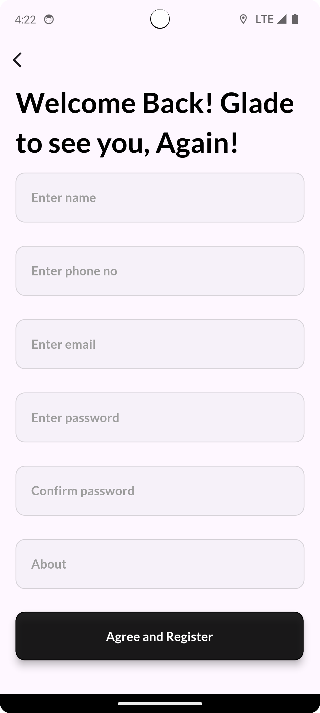
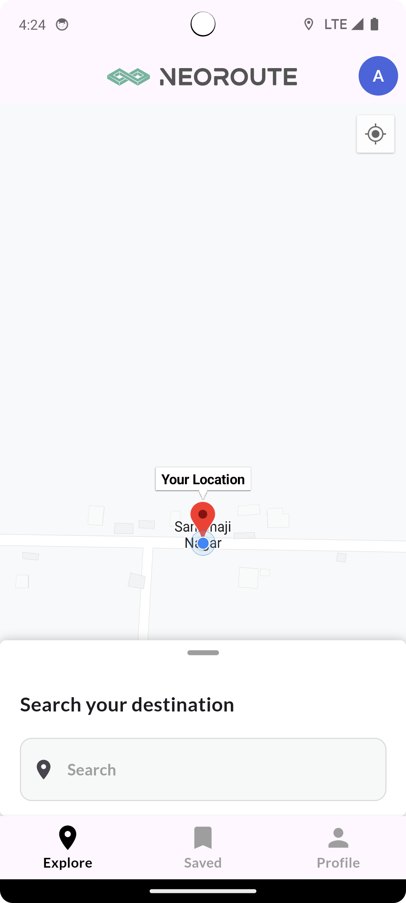
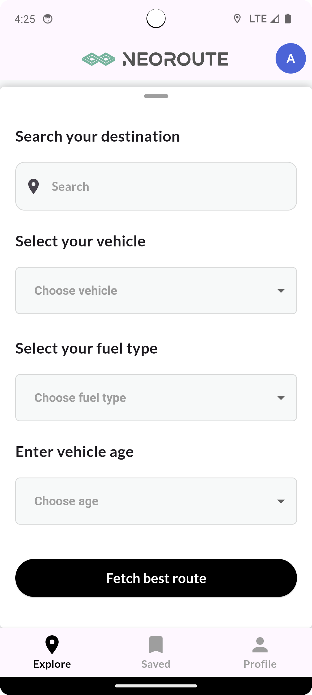
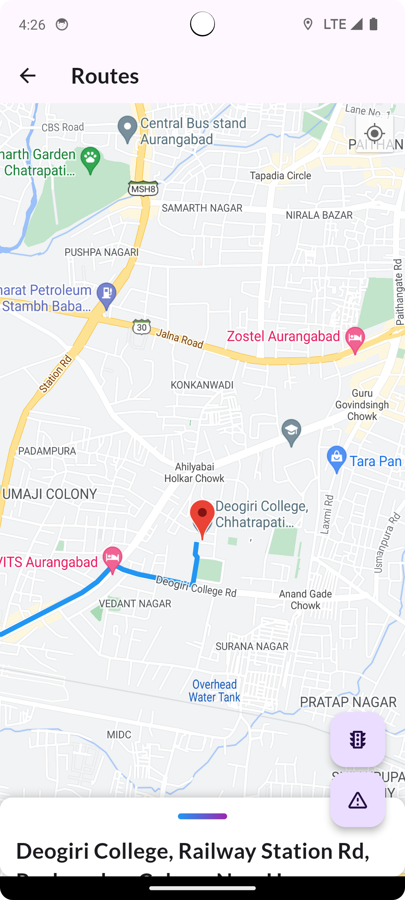
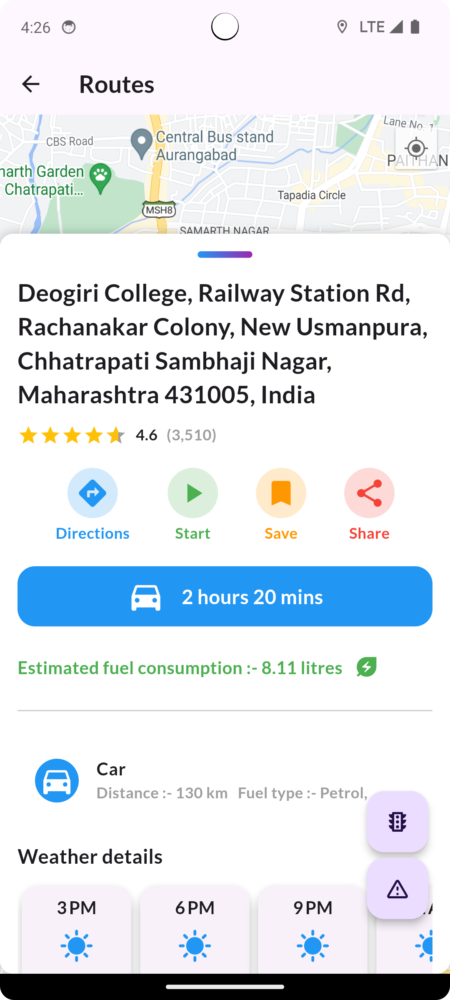
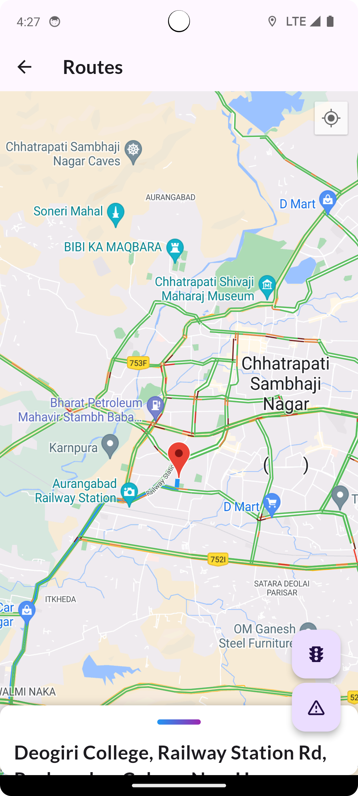
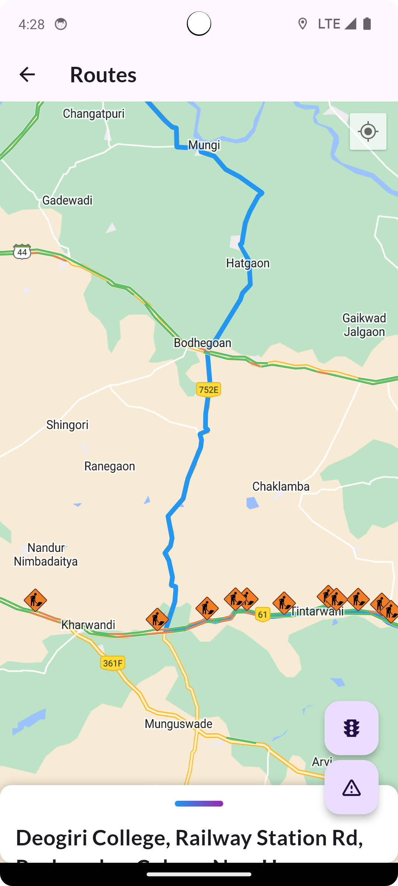
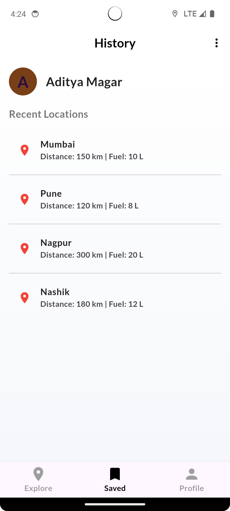
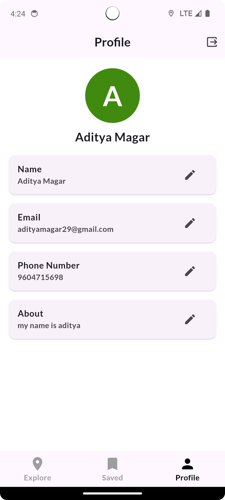

# Dynamic Route Optimization and Emission Reduction System

## 💡 Introduction

**Problem Statement**: Optimizing vehicle routes to ensure timely deliveries while minimizing environmental impact is a significant challenge in logistics and transportation. Our project addresses this issue through a dynamic routing system that integrates real-time traffic, weather, and vehicle data.

**Solution**: This solution uses a Python-based backend with Flask and a Flutter-based frontend in Dart. The system connects multiple APIs, including TomTom, Google Maps, AQICN, and OSRM, to recommend efficient routes and estimate vehicle emissions. It aims to enhance delivery efficiency, improve customer satisfaction, and reduce carbon footprints, promoting sustainability in logistics.

## Intro To NeoRoute Video
[](https://www.youtube.com/watch?v=RaYNFWcBbUM)

[](https://www.youtube.com/watch?v=RaYNFWcBbUM)


Short but detailed introduction to NeoRoute. Click on the image above to watch the video.

---

## 🎯 Goals and Objectives

- **Optimize Vehicle Routes**: Recommends efficient routes by considering real-time traffic and weather data.
- **Estimate Emissions**: Provides detailed emission data for each route to support eco-friendly decisions.
- **Enhance User Experience**: Features a user-friendly interface to improve accessibility.
- **Promote Sustainability**: Supports environmental goals through reduced emissions and efficient resource use.

---

## 📊 Features

- **Dynamic Route Optimization**: Suggests real-time efficient routes based on traffic and weather conditions.
- **Emissions Estimation**: Calculates and displays carbon emissions for every route option.
- **Customizable Inputs**: Allows users to input specific vehicle details for tailored route suggestions.
- **Interactive Visualizations**: Displays route options and emissions data clearly.

---

## 🛠 Tech Stack

### Frontend
- **Framework**: Flutter
- **Language**: Dart

### Backend
- **Framework**: Flask
- **Language**: Python

### APIs Utilized
- **TomTom**: Real-time traffic data
- **Google Maps**: Mapping and geospatial data
- **AQICN**: Air quality and meteorological data
- **OSRM**: Route generation and optimization

---

## 🚀 Getting Started

### Prerequisites

- Python 3.x
- Flutter SDK
- Dart SDK
- Virtual environment for Python

## 📸 App Screenshots

Here are some screenshots of our app:

### App Pages

<table style="width: 100%;">
  <tr>
    <td align="center" width="25%">
      <br>
      <b>Start Screen</b><br>
      Displays the NeoRoute logo and allow users login or signup
    </td>
    <td align="center" width="25%">
      <br>
      <b>Sign up page</b><br>
      Allows users to create account with entering his email and password
    </td>
     <td align="center" width="25%">
      <br>
      <b>Sign up page</b><br>
      allows users to login if they already have account
    </td>
    <td align="center" width="25%">
      <br>
      <b>Home screen</b><br>
       home screen showing current location of user
    </td>
   
  </tr>

  <tr>
     <td align="center" width="25%">
      <br>
      <b>Adding details screen</b><br>
        user can specify the destination and featch route
    </td>
    <td align="center" width="25%">
      <br>
      <b>Route Screen</b><br>
      Displays the route to specified destination along with other details
    </td>
    <td align="center" width="25%">
      <br>
      <b>Map Screen</b><br>
      user can see various information realted to destination
    </td>
    <td align="center" width="25%">
      <br>
      <b>Details screen</b><br>
       along with location user can also see other details like weather
    </td>
  </tr>

   <tr>
     <td align="center" width="25%">
      <br>
      <b>Traffic screen</b><br>
        user can also see the traffic details on the map
    </td>
    <td align="center" width="25%">
      <br>
      <b>Incident Screen</b><br>
      Displays the incidents happened in the route
    </td>
    <td align="center" width="25%">
      <br>
      <b>History Screen</b><br>
      user can save the locations searched that will be displayed here
    </td>
    <td align="center" width="25%">
      <br>
      <b>Profile screen</b><br>
       User can see his profile details and also edit them 
    </td>

  </tr>
  </table>

### Setup Instructions

1. **Clone the Repository**:
   ```bash
   git clone https://github.com/AbhishekRDJ/HackathonHub-.git
   cd HackathonHub-
   ```

2. **Backend Setup**:
   - Navigate to the backend directory:
     ```bash
     cd flask_backend
     ```
   - Create and activate a virtual environment:
     ```bash
     python3 -m venv venv
     source venv/bin/activate  # On Windows: venv\Scripts\activate
     ```
   - Install dependencies:
     ```bash
     pip install -r requirements.txt
     ```
   - Run the Flask server:
     ```bash
     flask run
     ```

3. **Frontend Setup**:
   - Navigate to the frontend directory:
     ```bash
     cd routing_app
     ```
   - Install dependencies:
     ```bash
     flutter pub get
     ```
   - Run the Flutter application:
     ```bash
     flutter run
     ```

---

## 📋 Contribution Guidelines

We welcome contributions to enhance this project! Please follow these steps:

1. Fork the repository.
2. Create a new branch:
   ```bash
   git checkout -b feature-name
   ```
3. Commit your changes:
   ```bash
   git commit -m "Add feature-name"
   ```
4. Push to your branch:
   ```bash
   git push origin feature-name
   ```
5. Open a pull request for review.

---

## 🏆 Achievements and Impact

- **Real-Time Data Integration**: Ensures the most accurate and up-to-date route suggestions.
- **Enhanced Sustainability**: Actively contributes to reducing carbon emissions.
- **User-Friendly Interface**: Intuitive design allows for easy navigation and use.

---

<!-- ## 📜 License

This project is licensed under the [MIT License](LICENSE). -->

---

## 🤝 Acknowledgements

- FedEx SMART Hackathon for providing the problem statement and platform for innovation.
- API providers: TomTom, Google Maps, AQICN, and OSRM for essential data integration.

---

## 📎 Resources

- [Flutter Documentation](https://docs.flutter.dev/)
- [Python Flask Documentation](https://flask.palletsprojects.com/en/2.0.x/)
- [TomTom API Documentation](https://developer.tomtom.com/)
- [Google Maps API Documentation](https://developers.google.com/maps/)
- [AQICN API Documentation](https://aqicn.org/api/)
- [OSRM Documentation](http://project-osrm.org/)

---

Join us in transforming logistics with efficient, eco-friendly routing solutions!

